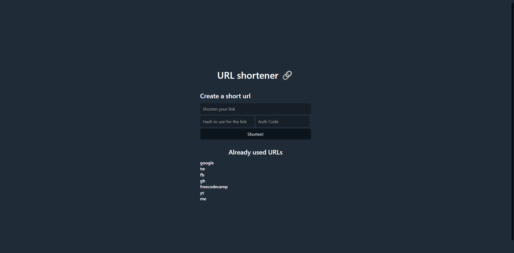

<div align="center">
  <h1 align="center"><a href="https://url.asjordi.dev/">URL Shortener</a></h1>

  <p align="center">URL Shortener with Java and Jakarta EE</p>
</div>

## About :computer:

URL Shortener is a web application that allows you to shorten URLs with a custom alias. To do this, it uses MySQL to store the URLs and the aliases. Implements a AUTH_CODE to protect the creation of new URLs. The application is developed with Java and Jakarta EE. Implements JDBC and JPA to interact with the database. The application is deployed on a VPS using Docker.




## Demo :movie_camera:

https://github.com/ASJordi/url-shortener-java/assets/48893030/ce0019c5-de80-4144-bb62-973210f1fea0

## Stack :hammer_and_wrench:

* Java SE
* Jakarta EE
* JPA - Hibernate
* JDBC
* JSP
* JSTL
* CDI
* Tomcat
* MySQL
* CSS
* Water.css

## Installation :gear:

> You can run the application in a Docker container or in your local environment.

> If you don't want to build the application, you can download the Docker image from the [Packages section](https://github.com/ASJordi/url-shortener-java/pkgs/container/url-shortener-java)

### Docker :whale:

- Build the Docker image

  ```bash
  docker build -t todo-app .
  ```

- Run the Docker container

  ```bash
    docker container run -p 8080:8080 todo-app
  ```

- Use `docker-compose` to run the application with MySQL and PhpMyAdmin

  ```bash
  docker compose up -d
  ```

> Make sure to create the database with the script in `src/main/resources/db/db.sql` before running the application.

### Local :computer:

- Clone the repository

  ```bash
  git@github.com:ASJordi/url-shortener-java.git
  ```

- Create a MySQL database with the script in `src/main/resources/db/db.sql`

- Configure the database connection in `src/main/webapp/META-INF/context.xml`

- Install dependencies with Maven

- Configure tomcat to use the MySQL connector

- Run the application with:

  ```bash
  mvn tomcat7:redeploy
  ```

## License :page_facing_up:

Distributed under the MIT License. See `LICENSE` for more information.

## Contact :email:

Jordi Ayala - [@ASJordi](https://twitter.com/ASJordi)

Project Link: [https://github.com/ASJordi/url-shortener-java](https://github.com/ASJordi/url-shortener-java)
